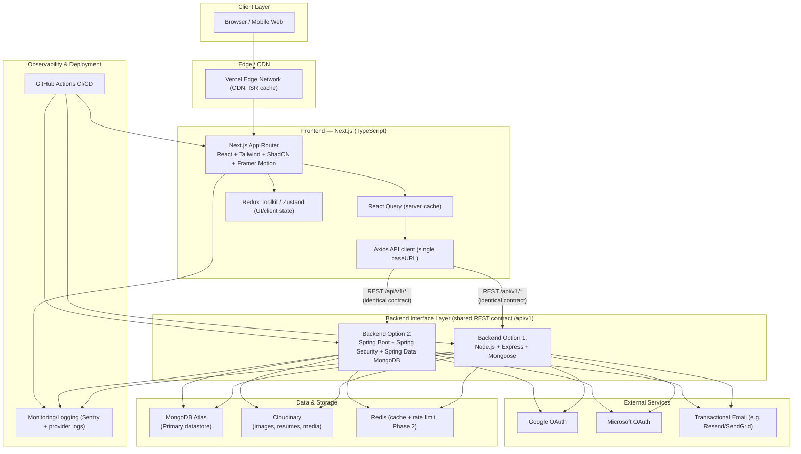
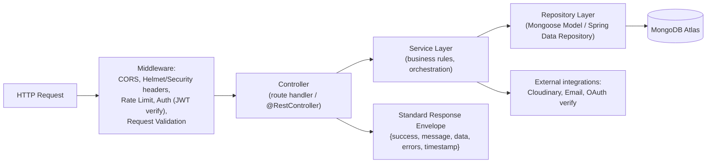

# 11. High-Level Design (HLD)

## 11.1 System Architecture Overview

The system is a **decoupled, API-first architecture**: one Next.js frontend, and two
interchangeable backend implementations (Node/Express and Spring Boot) that both satisfy an
identical REST contract ("Backend Interface Layer" — BIL) against a shared MongoDB Atlas
cluster.

**Only one backend runs in production at a time**, selected via
`NEXT_PUBLIC_API_BASE_URL`. Both are shown because the architecture must support switching
without frontend changes — they are not meant to run simultaneously against writes (that would
require distributed-write coordination, out of scope). A blue/green style backend swap is
acceptable (drain traffic, point env var to the other backend, both read the same Mongo data).

## 11.2 Frontend Architecture
- **Framework:** Next.js (App Router), TypeScript strict mode.
- **Rendering strategy per route type:**
  - Public marketing/content pages (About, Blogs, Projects, Events list) → **ISR** (Incremental
    Static Regeneration), revalidate 60s, so content updates propagate without a full rebuild.
  - Public detail pages with SEO needs (`/blog/[slug]`, `/events/[slug]`) → **SSR/ISR hybrid**
    (`generateStaticParams` + `revalidate`).
  - Authenticated Member Portal / Admin Dashboard → **CSR** behind auth guard (no SEO need,
    fully client-rendered with React Query driving all data).
- **State split:** Server state (anything from the API) lives in **React Query** exclusively
  (cache, retries, optimistic updates). Client-only UI state (theme, sidebar collapsed, modal
  open) lives in **Zustand** (chosen over Redux Toolkit for its lower boilerplate; Redux Toolkit
  listed as an acceptable alternative if the team prefers RTK's devtools/middleware ecosystem —
  see `10-frontend-state-management.md` for the concrete decision and slice/store shape).
- **API layer:** A single Axios instance (`lib/api/client.ts`) with a base URL from env,
  request interceptor attaching the JWT, response interceptor handling 401 → silent refresh →
  retry-once → hard logout on second failure. All endpoint calls go through typed wrapper
  functions (`lib/api/events.ts`, `lib/api/recruitment.ts`, …) — **no component ever calls
  `axios` directly**, ensuring the entire app depends on one contract surface that can be
  swapped/mocked in tests.

## 11.3 Backend Architecture (both variants, same layering)
Both backends follow **Clean/Layered Architecture**: `Controller → Service → Repository → DB`,
with DTOs at the controller boundary and domain models internal. This is deliberate so a
developer moving between the Node and Spring codebases recognizes the same mental model.

- **Controllers:** thin — parse/validate request (DTO), call one service method, map result to
  the standard response envelope (Section 34 in `17-env-vars-response-format-error-logging.md`).
- **Services:** own all business rules (Section 3 of this PRD) — e.g., capacity checks,
  recruitment cycle state machine, judging score aggregation.
- **Repositories:** own all persistence — no service ever constructs a raw Mongo query inline;
  everything goes through a repository method (`EventRepository.findPublishedUpcoming()`, etc.),
  which keeps query logic testable/mockable and keeps indexes/consistency concerns centralized.
- **DTOs & Validation:** Node uses Zod schemas per resource (mirrored from frontend's Zod
  schemas conceptually, kept in a shared `@mmil/contracts` npm package if monorepo, or
  duplicated with a contract-test guard if polyrepo). Spring uses `jakarta.validation` (Bean
  Validation) annotations on request DTOs + a global `@ControllerAdvice` exception handler.

## 11.4 Database Layer
MongoDB Atlas, single cluster at launch (M10+ tier for production), collections detailed in
`07-database-design.md`. Multi-tenant-ready via a `chapterId` field present on every
tenant-scoped collection from day one (even with one chapter, avoids a painful migration).

## 11.5 Authentication Layer
Stateless JWT (access + refresh), OAuth 2.0 (Google, Microsoft) via Authorization Code flow
with PKCE, verified server-side, mapped to (or creating) a `users` document. Full detail in
`12-auth-authorization-security.md`.

## 11.6 Cloud Storage
Cloudinary for all binary media (images, PDFs/resumes, certificate PDFs). Both backends use
**signed upload** (short-lived signature generated server-side, actual bytes uploaded directly
browser→Cloudinary) — the API servers never proxy file bytes, keeping them stateless and
reducing backend load/cost.

## 11.7 Notification Service
Internal module (not a separate deployed service at MVP scale) responsible for: in-app
notification documents (`notifications` collection) + triggering transactional email via the
Email provider. Designed with a clean interface (`NotificationService.send(event, payload)`)
so it can be extracted into a standalone service (queue-driven) at Phase 3 scale without
touching callers (see `13-performance-scalability-devops.md`, Event-Driven readiness).

## 11.8 Analytics
MVP: server-side MongoDB aggregation pipelines (`$facet`, `$group`) computed on-demand (with
short TTL caching) for the Analytics Dashboard — no separate analytics warehouse needed at
launch scale. Future: pipe events to a warehouse (BigQuery/ClickHouse) if usage outgrows
on-demand aggregation (see Section 15 roadmap).

## 11.9 Monitoring, Logging, Error Handling
- **Frontend:** Sentry (or equivalent) for client error tracking + Web Vitals reporting.
- **Backend:** structured JSON logs (Section 36, `17-...md`) shipped to the platform's log
  aggregator (Render/Railway/Azure native logging), Sentry for exception tracking in both
  Node and Spring backends.
- **Health checks:** `/api/v1/health` (liveness) and `/api/v1/health/ready` (readiness — checks
  Mongo connectivity) on both backend variants, used by the deploy platform and any future load
  balancer.

## 11.10 Deployment Topology
- **Frontend:** Vercel (Next.js native), preview deployments per PR, production on `main`.
- **Backend:** Render/Railway (Node) or Azure App Service/Container Apps (Spring Boot),
  containerized (Dockerfile per backend — see `06-lld-folder-structures.md`), horizontally
  scalable (stateless, so N replicas behind the platform's built-in load balancer).
- **Database:** MongoDB Atlas (managed), separate clusters/DBs per environment
  (dev/staging/prod), IP-allowlisted + VPC peering where the platform supports it.
- **CDN:** Vercel Edge for frontend assets/ISR pages; Cloudinary's own CDN for media.

## 11.11 Caching Strategy
- Next.js ISR cache for public pages (edge-cached, revalidated).
- React Query client-side cache (staleTime tuned per resource: Events list 60s, static content
  like FAQs 10min).
- Backend: Redis introduced at Phase 2 for (a) rate-limiting counters, (b) hot aggregation
  results (Analytics Dashboard), (c) OAuth state/session helper data. Not required for MVP
  functional correctness, but the service interfaces are written cache-ready
  (`CacheService.get/set/invalidate` abstraction) so adding Redis later is additive, not a
  refactor.

## 11.12 CDN
Vercel Edge Network for the app shell/static assets/ISR HTML; Cloudinary CDN for all images,
resumes, and generated certificate PDFs.

## 11.13 Security (overview — full detail in `12-auth-authorization-security.md`)
CORS locked to known frontend origins per environment, Helmet (Node) / Spring Security headers
equivalent, input validation at every layer boundary, rate limiting on auth/public write
endpoints, secrets via platform env var stores (never committed), password hashing via bcrypt
(Node)/BCryptPasswordEncoder (Spring).

## 11.14 Scalability & Load Balancing
Stateless backend replicas behind the deploy platform's load balancer; MongoDB Atlas
auto-scaling storage + read replicas for read-heavy public pages; horizontal scale-out is the
default strategy (not vertical), consistent with the 100,000+ user design target (see
`13-performance-scalability-devops.md`).
