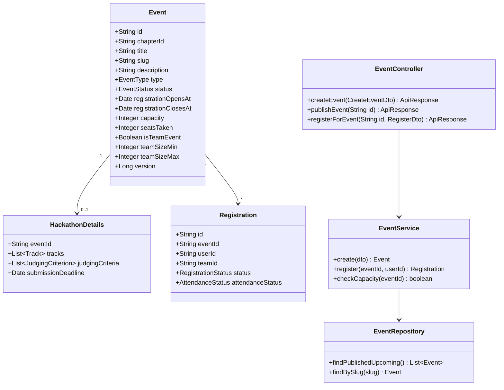
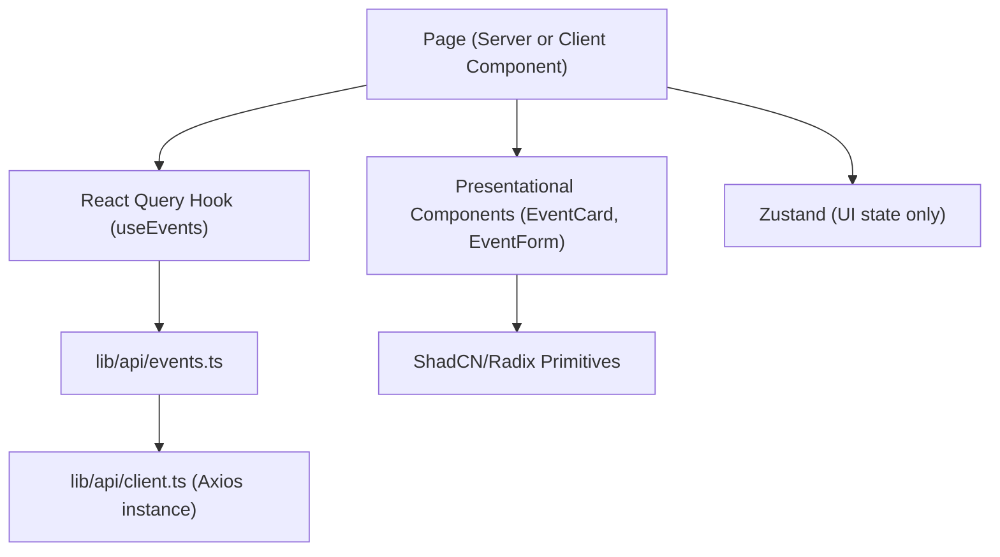
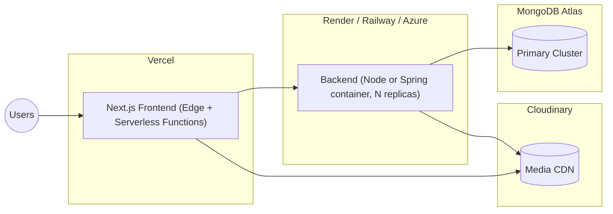
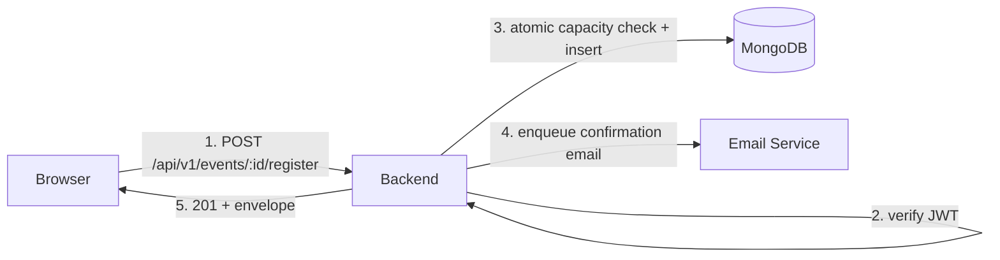

# 12. Low-Level Design (LLD)

## 12.1 Frontend Folder Structure (Next.js App Router)
```
mmil-frontend/
├── app/
│   ├── (public)/
│   │   ├── page.tsx                     # Landing
│   │   ├── about/
│   │   ├── events/[slug]/page.tsx
│   │   ├── events/hackathons/[slug]/page.tsx
│   │   ├── blog/[slug]/page.tsx
│   │   ├── projects/[slug]/page.tsx
│   │   ├── recruitment/[cycleSlug]/page.tsx
│   │   ├── gallery/[albumSlug]/page.tsx
│   │   ├── verify/[certificateId]/page.tsx
│   │   └── ...
│   ├── (auth)/
│   │   ├── login/page.tsx
│   │   ├── signup/page.tsx
│   │   └── ...
│   ├── (portal)/portal/
│   │   ├── layout.tsx                    # auth guard
│   │   ├── dashboard/page.tsx
│   │   ├── profile/page.tsx
│   │   ├── my-events/page.tsx
│   │   └── ...
│   ├── (admin)/admin/
│   │   ├── layout.tsx                    # role guard
│   │   ├── dashboard/page.tsx
│   │   ├── events/page.tsx
│   │   ├── events/[id]/attendance/page.tsx
│   │   ├── recruitment/[cycleId]/pipeline/page.tsx
│   │   └── ...
│   ├── api/                              # (only if BFF-style edge routes needed; core APIs live in the separate backend)
│   ├── layout.tsx                        # root layout: theme provider, query provider
│   └── globals.css
├── components/
│   ├── ui/                               # ShadCN primitives (button, dialog, input, ...)
│   ├── layout/                           # Navbar, Footer, Sidebar, MegaMenu
│   ├── events/                           # EventCard, EventForm, RegistrationModal
│   ├── recruitment/                      # ApplicationForm (dynamic), PipelineBoard
│   ├── blog/                             # BlogCard, RichTextRenderer
│   ├── projects/                         # ProjectCard, ProjectForm
│   ├── admin/                            # DataTable, StatCard, AuditLogTable
│   └── shared/                           # EmptyState, Skeletons, ErrorBoundary
├── lib/
│   ├── api/
│   │   ├── client.ts                     # single Axios instance
│   │   ├── events.ts
│   │   ├── recruitment.ts
│   │   ├── auth.ts
│   │   └── ...                           # one file per resource, typed wrapper functions
│   ├── hooks/
│   │   ├── useEvents.ts                  # React Query hooks
│   │   ├── useAuth.ts
│   │   └── ...
│   ├── validators/                       # Zod schemas (mirrors backend DTOs)
│   ├── store/                            # Zustand stores (ui.store.ts, theme.store.ts)
│   └── utils/
├── types/
│   └── *.d.ts                            # generated/shared TS types from OpenAPI spec
├── public/
│   └── illustrations/
├── middleware.ts                          # auth/role route protection at edge
├── next.config.js
├── tailwind.config.ts
├── tsconfig.json
└── package.json
```

## 12.2 Backend Folder Structure — Node.js / Express
```
mmil-backend-node/
├── src/
│   ├── config/
│   │   ├── env.ts                        # validated env (zod)
│   │   ├── db.ts                         # Mongo connection
│   │   └── cloudinary.ts
│   ├── modules/
│   │   ├── auth/
│   │   │   ├── auth.controller.ts
│   │   │   ├── auth.service.ts
│   │   │   ├── auth.routes.ts
│   │   │   ├── auth.validator.ts         # Zod DTOs
│   │   │   └── auth.repository.ts
│   │   ├── users/
│   │   ├── events/
│   │   ├── hackathons/
│   │   ├── recruitment/
│   │   ├── projects/
│   │   ├── blogs/
│   │   ├── gallery/
│   │   ├── certificates/
│   │   ├── notifications/
│   │   ├── announcements/
│   │   ├── sponsors/
│   │   ├── roles/
│   │   ├── auditLogs/
│   │   └── settings/
│   │        (each module mirrors auth/'s 5-file shape: controller, service, routes, validator, repository)
│   ├── middlewares/
│   │   ├── auth.middleware.ts            # JWT verify
│   │   ├── rbac.middleware.ts            # permission check
│   │   ├── rateLimit.middleware.ts
│   │   ├── errorHandler.middleware.ts
│   │   └── requestLogger.middleware.ts
│   ├── shared/
│   │   ├── responseEnvelope.ts
│   │   ├── errors/ (AppError, NotFoundError, ValidationError, ForbiddenError...)
│   │   └── pagination.ts
│   ├── jobs/                             # background jobs (repo liveness check, cert PDF gen)
│   ├── app.ts                            # express app assembly (middleware order, routes mount)
│   └── server.ts                         # entrypoint
├── tests/
│   ├── unit/
│   ├── integration/
│   └── e2e/
├── Dockerfile
├── docker-compose.yml
├── .env.example
├── package.json
└── tsconfig.json
```

## 12.3 Backend Folder Structure — Spring Boot
```
mmil-backend-spring/
├── src/main/java/com/mmil/backend/
│   ├── config/
│   │   ├── SecurityConfig.java
│   │   ├── MongoConfig.java
│   │   ├── CorsConfig.java
│   │   └── CloudinaryConfig.java
│   ├── common/
│   │   ├── response/ApiResponse.java     # standard envelope
│   │   ├── exception/ (GlobalExceptionHandler, AppException, NotFoundException, ...)
│   │   └── pagination/PageRequestDto.java
│   ├── security/
│   │   ├── JwtAuthFilter.java
│   │   ├── JwtService.java
│   │   ├── OAuth2SuccessHandler.java
│   │   └── RbacAspect.java               # @PreAuthorize-based permission checks
│   ├── modules/
│   │   ├── auth/
│   │   │   ├── AuthController.java
│   │   │   ├── AuthService.java
│   │   │   ├── dto/ (LoginRequest, SignupRequest, AuthResponse)
│   │   │   └── AuthServiceImpl.java
│   │   ├── user/
│   │   │   ├── UserController.java
│   │   │   ├── UserService.java / UserServiceImpl.java
│   │   │   ├── UserRepository.java       # extends MongoRepository
│   │   │   ├── dto/ (UserRequestDto, UserResponseDto)
│   │   │   └── User.java                 # @Document domain model
│   │   ├── event/  (mirrors user/'s shape: Controller, Service, Repository, dto/, Event.java)
│   │   ├── hackathon/
│   │   ├── recruitment/
│   │   ├── project/
│   │   ├── blog/
│   │   ├── gallery/
│   │   ├── certificate/
│   │   ├── notification/
│   │   ├── announcement/
│   │   ├── sponsor/
│   │   ├── role/
│   │   ├── auditlog/
│   │   └── setting/
│   └── BackendApplication.java
├── src/main/resources/
│   ├── application.yml
│   ├── application-dev.yml
│   └── application-prod.yml
├── src/test/java/com/mmil/backend/       # JUnit5 + Mockito + Testcontainers(Mongo)
├── Dockerfile
├── pom.xml
└── .env.example (mapped into application.yml via ${VAR})
```

## 12.4 Class Diagram (representative — Event domain, Spring variant; Node mirrors conceptually via TS interfaces)


## 12.5 Component Diagram (Frontend)


## 12.6 Deployment Diagram


## 12.7 Communication Diagram (Event Registration, condensed)

