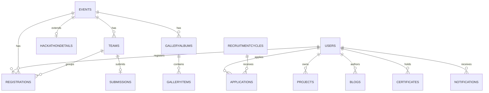

# 13. Database Design (MongoDB)

**Conventions applied to every collection:**
- `_id`: ObjectId (Mongo default)
- `chapterId`: String — multi-tenancy key, indexed, defaults to a single seed value at launch
- **Audit fields:** `createdAt`, `updatedAt` (Date, auto via timestamps), `createdBy`,
  `updatedBy` (ObjectId ref → users)
- **Soft delete:** `isDeleted: Boolean` (default false) + `deletedAt: Date | null`. All
  repository "find" methods filter `isDeleted: false` by default; hard delete is never exposed
  via API (admin "delete" = soft delete; permanent purge is a manual DB-ops action only).
- **Optimistic concurrency:** `version: Number` (incremented on every update; mutation
  endpoints require the client to send the version they last read — mismatch → 409).

## 13.1 `users`
| Field | Type | Notes |
|---|---|---|
| name | String | required |
| email | String | required, unique index |
| passwordHash | String | null if OAuth-only account |
| oauthProviders | Array<{provider: "google"\|"microsoft", providerId: String}> | |
| role | String enum | `guest` excluded (guests aren't persisted); one of `student, alumni, recruiter, coordinator, core-team, faculty, leadership, admin` |
| domainScope | Array\<String\> | for `coordinator` — which verticals they manage |
| isEmailVerified | Boolean | default false |
| avatarUrl | String | Cloudinary URL |
| bio, skills[], socialLinks{} | mixed | profile fields |
| resumeUrl | String | Cloudinary URL |
| graduationYear | Number | drives student→alumni auto-transition |
| isPublicProfile | Boolean | opt-in for recruiter visibility |
| status | String enum | `active, suspended` |
**Indexes:** `{email:1}` unique, `{role:1, chapterId:1}`, text index on `{name, skills}` for search.
**Relationships:** referenced by `registrations`, `applications`, `certificates`,
`notifications`, `projects.ownerId`, `blogs.authorId`.

## 13.2 `events`
| Field | Type | Notes |
|---|---|---|
| title, slug, description | String | slug unique per chapter, immutable post-publish |
| type | enum | `event, hackathon, workshop` |
| status | enum | `draft, published, cancelled, completed` |
| coverImageUrl | String | |
| startDate, endDate | Date | |
| registrationOpensAt, registrationClosesAt | Date | |
| capacity | Number\|null | null = unlimited |
| seatsTaken | Number | atomic counter |
| isTeamEvent | Boolean | |
| teamSizeMin, teamSizeMax | Number | |
| domain | String | e.g. Frontend/AI/Cloud — for filtering |
| coordinatorIds | Array<ObjectId ref users> | |
**Indexes:** `{slug:1, chapterId:1}` unique, `{status:1, startDate:1}`, `{type:1}`.
**TTL:** none (events are permanent history).

## 13.3 `hackathonDetails` (1:1 extension of `events` where `type=hackathon`)
| Field | Type | Notes |
|---|---|---|
| eventId | ObjectId ref events | unique |
| tracks | Array<{name, description}> | |
| judgingCriteria | Array<{name, weight, maxScore}> | weights sum to 1.0 (validated) |
| submissionDeadline | Date | |
| judgeIds | Array<ObjectId ref users> | |
| prizePool | Array<{rank, title, amount}> | |
**Indexes:** `{eventId:1}` unique.

## 13.4 `teams`
| Field | Type | Notes |
|---|---|---|
| eventId | ObjectId ref events | |
| name | String | |
| leaderId | ObjectId ref users | |
| memberIds | Array<ObjectId ref users> | length within event's teamSizeMin/Max |
| isLocked | Boolean | true once registrationClosesAt passes |
**Indexes:** `{eventId:1, leaderId:1}`.

## 13.5 `registrations`
| Field | Type | Notes |
|---|---|---|
| eventId | ObjectId ref events | |
| userId | ObjectId ref users | |
| teamId | ObjectId ref teams \| null | |
| status | enum | `confirmed, waitlisted, cancelled` |
| attendanceStatus | enum | `not_marked, present, absent` |
| waitlistPosition | Number\|null | |
**Indexes:** `{eventId:1, userId:1}` unique (prevents double registration), `{eventId:1, status:1}`.

## 13.6 `submissions` (hackathon project submissions)
| Field | Type | Notes |
|---|---|---|
| eventId | ObjectId ref events | |
| teamId | ObjectId ref teams | |
| repoUrl, demoUrl | String | validated HTTPS |
| description | String | |
| scores | Array<{judgeId, criterionScores: [{criterionName, score}]}> | |
| finalScore | Number\|null | computed weighted average |
| rank | Number\|null | computed post-judging |
**Indexes:** `{eventId:1, teamId:1}` unique.

## 13.7 `recruitmentCycles`
| Field | Type | Notes |
|---|---|---|
| title, slug | String | |
| status | enum | `draft, open, closed` |
| opensAt, closesAt | Date | |
| domains | Array<{name, slug, formSchema: [{fieldKey, label, type, required, options}]}> | dynamic form definition |
| allowMultiDomain | Boolean | |
**Indexes:** `{status:1, chapterId:1}`, `{slug:1}` unique.

## 13.8 `applications`
| Field | Type | Notes |
|---|---|---|
| cycleId | ObjectId ref recruitmentCycles | |
| domainSlug | String | |
| applicantId | ObjectId ref users | |
| answers | Object (Mixed, keyed by fieldKey) | |
| status | enum | `applied, shortlisted, interview, offered, rejected` |
| reviewerNotes | Array<{reviewerId, note, createdAt}> | |
**Indexes:** `{cycleId:1, applicantId:1, domainSlug:1}` unique (allows multi-domain if flagged), `{cycleId:1, status:1}`.

## 13.9 `projects`
| Field | Type | Notes |
|---|---|---|
| title, slug, description | String | |
| ownerId | ObjectId ref users | |
| collaboratorIds | Array<ObjectId ref users> | |
| techStack | Array\<String\> | |
| repoUrl, demoUrl | String | |
| images | Array\<String\> (Cloudinary URLs) | max 10 |
| hackathonEventId | ObjectId\|null | |
| status | enum | `pending, approved, rejected` |
| visibility | enum | `public, private` |
| isFeatured | Boolean | |
**Indexes:** `{status:1, visibility:1}`, text index on `{title, description, techStack}`.

## 13.10 `blogs`
| Field | Type | Notes |
|---|---|---|
| title, slug, excerpt, contentRichText | String/JSON | |
| authorId | ObjectId ref users | |
| category, tags[] | String/Array | |
| coverImageUrl | String | |
| status | enum | `draft, published, scheduled` |
| publishAt | Date | for scheduled posts |
**Indexes:** `{status:1, publishAt:-1}`, `{slug:1}` unique, text index `{title, tags}`.

## 13.11 `gallery` / `galleryAlbums`
`galleryAlbums`: {title, slug, eventId, coverImageUrl}. `galleryItems`: {albumId, mediaUrl,
mediaType: image|video, caption}. **Indexes:** `{albumId:1}`.

## 13.12 `certificates`
| Field | Type | Notes |
|---|---|---|
| certificateId | String (UUID v4) | unique, public-facing |
| userId | ObjectId ref users | |
| type | enum | `participation, winner, coordinator, appreciation` |
| eventId or cycleId | ObjectId | source reference |
| pdfUrl | String | Cloudinary |
| verificationHash | String | HMAC signature |
| status | enum | `active, revoked` |
| issuedAt | Date | |
**Indexes:** `{certificateId:1}` unique, `{userId:1}`.

## 13.13 `notifications`
| Field | Type | Notes |
|---|---|---|
| userId | ObjectId ref users \| null | null = broadcast |
| type | String | e.g. `registration_confirmed`, `application_status_changed` |
| title, body | String | |
| isRead | Boolean | |
| link | String\|null | deep link into portal |
**Indexes:** `{userId:1, isRead:1, createdAt:-1}`. **TTL:** optional 180-day TTL index on
`createdAt` for read notifications to keep the collection lean.

## 13.14 `announcements`
{title, body, priority: normal\|urgent, startsAt, endsAt, audience: all\|students\|staff}.
**Indexes:** `{endsAt:1}` (drives active-announcement query), TTL not used (kept for history).

## 13.15 `sponsors`
{name, logoUrl, tier: platinum\|gold\|silver\|partner, websiteUrl, isActive}.

## 13.16 `resources`
{title, description, url, track (Frontend/Backend/AI/Cloud/...), type: article\|video\|course}.
**Indexes:** `{track:1}`.

## 13.17 `faqs`
{question, answer, category, order}. **Indexes:** `{category:1, order:1}`.

## 13.18 `testimonials`
{authorName, authorRole, quote, avatarUrl, isFeatured}.

## 13.19 `contactMessages`
{name, email, subject, message, status: new\|read\|resolved}. **TTL:** none (support record).

## 13.20 `newsletterSubscribers`
{email (unique), isConfirmed, confirmationToken, subscribedAt}. **Indexes:** `{email:1}` unique.

## 13.21 `roles` / `permissions`
`roles`: {key, label, description}. `permissions`: {key, label, module}. `rolePermissions`
(join): {roleKey, permissionKey}. This normalized structure lets `admin` reconfigure
permission→role mapping at runtime without a code deploy (read by the RBAC middleware/aspect
on every request, cached in-memory with short TTL).

## 13.22 `auditLogs`
| Field | Type | Notes |
|---|---|---|
| actorId | ObjectId ref users | |
| action | String | e.g. `event.publish`, `application.status_change` |
| entityType, entityId | String | |
| before, after | Mixed (JSON snapshot) | |
| ipAddress | String | |
**Indexes:** `{entityType:1, entityId:1, createdAt:-1}`, `{actorId:1, createdAt:-1}`.
**Immutable:** no update/delete endpoints exist for this collection — write-once.

## 13.23 `settings`
Singleton document per chapter: {siteName, socialLinks, featureFlags: {chatbotEnabled,
pushNotificationsEnabled, ...}, integrationMeta (non-secret config only — actual secrets stay
in env vars, never in this collection)}.

## 13.24 Relationship Summary (ER overview)

