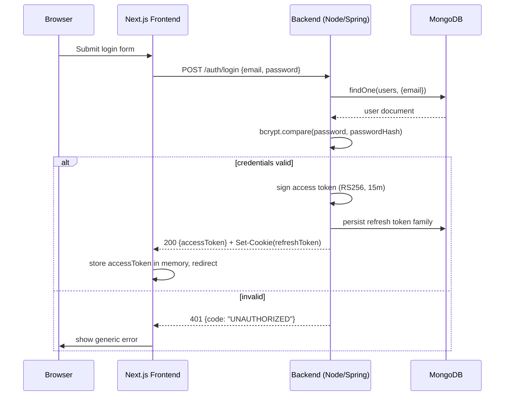
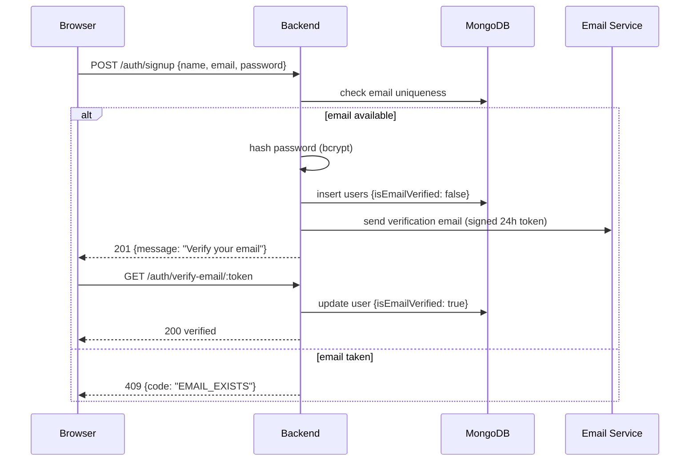
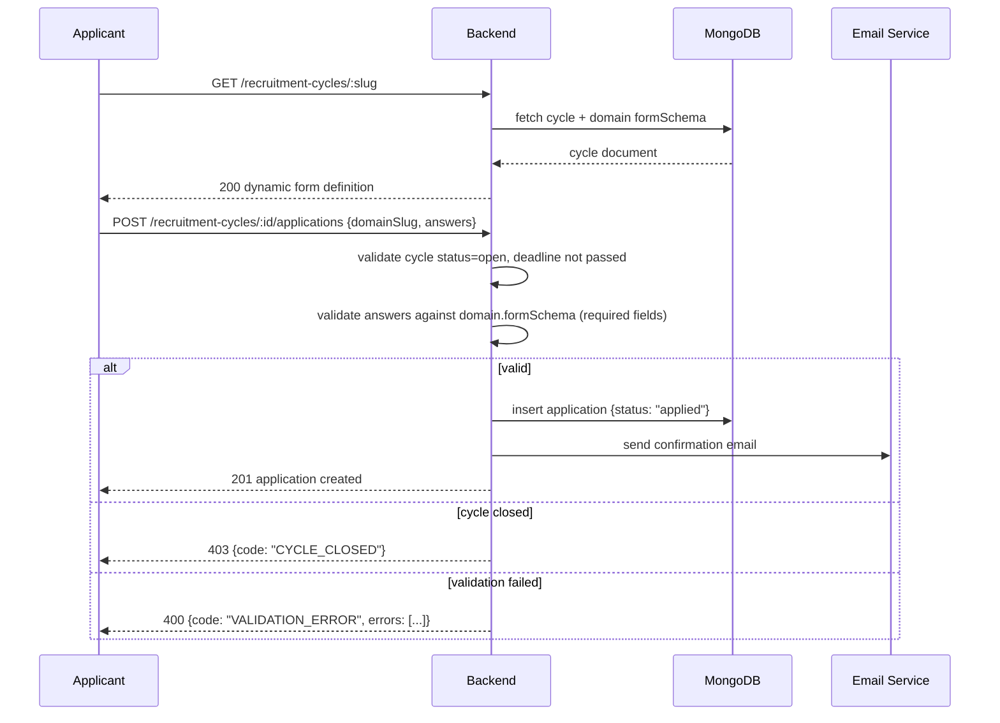
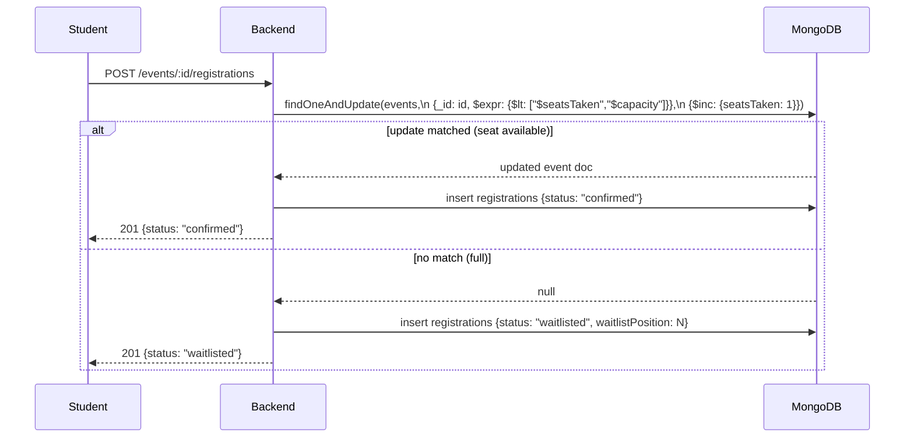
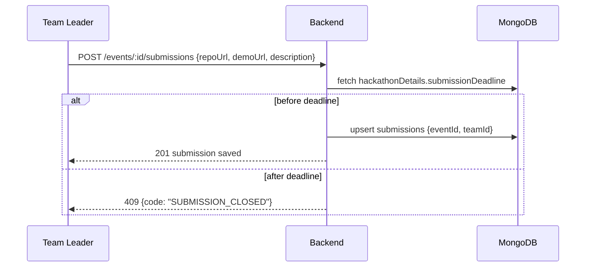
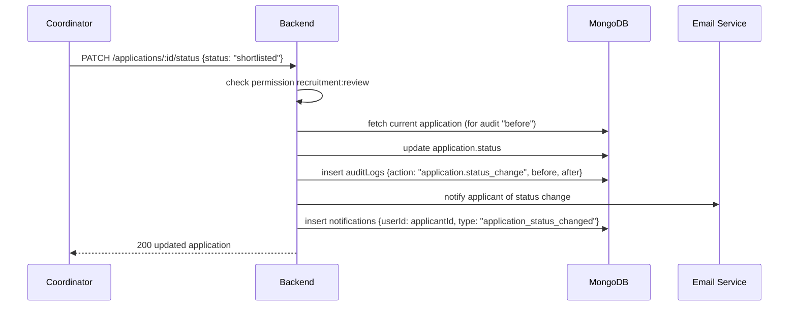

# 37. Complete Sequence Diagrams

## 37.1 Authentication (Email/Password Login)

## 37.2 Registration (Signup)

## 37.3 Recruitment Application Submission

## 37.4 Event Registration (with capacity race handling)

## 37.5 Project Submission (Hackathon)

## 37.6 Admin Approval (Application Status Change)

